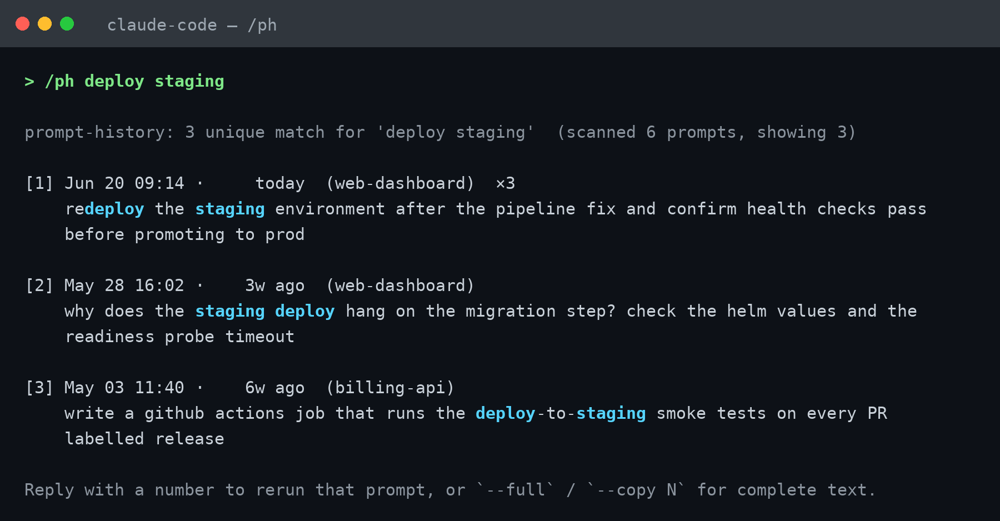

# claude-ph

[](https://github.com/YASoftwareDev/claude-ph/actions/workflows/ci.yml)
[](LICENSE)

**Full-history search for your Claude Code prompts — across every project, all the way back, right inside the session.**

`/ph` is a tiny Claude Code slash command that searches your *entire* prompt
history. It exists because Claude Code's built-in recall can't.



<sub>Output shown with synthetic data. Search terms are highlighted; `×3` marks a prompt you reused 3 times.</sub>

## Why it exists

Claude Code's native prompt recall — the `↑` arrow and the `Ctrl+R` reverse
search — only loads the **100 most recent unique prompts** in the selected
scope. This is official, documented behavior (see the *Command history* section
of the [Claude Code interactive-mode docs](https://code.claude.com/docs/en/interactive-mode#command-history)),
and it is **not configurable**: there is no setting, environment variable, or
flag to raise the cap. Feature requests asking for deeper / searchable history
have been closed without a shipped solution — e.g.
[anthropics/claude-code#11923](https://github.com/anthropics/claude-code/issues/11923)
(searchable prompt history via a `/history` command) and
[anthropics/claude-code#40369](https://github.com/anthropics/claude-code/issues/40369)
(dedicated history viewer, closed as *not planned*).

For an active user that 100-entry window is often **only about a week** of work.
Yet every prompt you have ever typed is sitting in `~/.claude/history.jsonl`
(which grows without bound) — you just can't reach it from the picker.

`claude-ph` reads that file directly and searches all of it: every project,
every day, no cap.

## What it does

- Searches the complete `~/.claude/history.jsonl` (all projects, all time).
- **Numbered results**, newest first, so you can act on a specific one.
- **Rerun-by-number**: after a search, reply with a result's number and Claude
  re-issues that prompt as if you had typed it (adapting stale paths to the
  current project).
- **Duplicate collapsing** with `×N` repeat counts — reran the same prompt 12
  times? You see it once, marked `×12`.
- **Match highlighting** — your search terms are bolded in each result.
- **Friendly dates** — `Apr 18 17:55 · 2mo ago`.
- `--full` for complete prompt text, `--copy N` to print one prompt raw,
  `--projects` for an overview of every project that has history.

## Install

### One line

```sh
curl -fsSL https://raw.githubusercontent.com/YASoftwareDev/claude-ph/main/install.sh | sh
```

### Or by hand

Two files, two locations under your Claude Code config directory:

```sh
mkdir -p ~/.claude/scripts ~/.claude/commands
cp ph.py  ~/.claude/scripts/ph.py     # the searcher
cp ph.md  ~/.claude/commands/ph.md     # the /ph slash command
```

Either way, then **restart Claude Code** so it picks up the new command. That's
it — no dependencies beyond Python 3 (standard library only).

> Prefer to let Claude install it for you? Open this repo in a Claude Code
> session and ask it to "install this tool" — `CLAUDE.md` automates the copy.

## Usage

Inside a Claude Code session:

```
/ph TERMS                 search history; all terms must match (AND), case-insensitive
```

### Flags

| Flag | Effect |
|------|--------|
| `--full` | Show full prompt text instead of truncating long prompts |
| `--copy N` | Print **only** match N's full text, raw — clean to copy or rerun |
| `--project NAME` | Restrict to projects whose path contains `NAME` |
| `--days N` | Only prompts from the last `N` days |
| `--limit N` | Show up to `N` matches (default 30) |
| `--oldest` | Oldest matches first (default: newest first) |
| `--regex P` | Treat the query as a single regular expression |
| `--projects` | List every project that has history, with prompt counts and date spans |

See [`examples/example-output.md`](examples/example-output.md) for a full
sample session showing the numbered results, highlighting, `×N` collapsing,
`--copy`, and `--projects` output.

### Worked examples

```
/ph livekit token            # prompts containing BOTH "livekit" and "token"
/ph --full barge-in          # show the complete text of matching prompts
/ph --copy 1 livekit token   # print match #1's full prompt, raw — ready to reuse
/ph --project asr-eval deploy# only the "asr-eval" project's prompts mentioning deploy
/ph --days 30 setup          # "setup" prompts from the last 30 days
/ph --limit 80 train         # widen the result list to 80
/ph --oldest migration       # earliest "migration" prompts first
/ph --regex "deploy|release" # regex search
/ph --projects               # overview of every project with history
```

### Rerun-by-number

After any search you get a numbered list:

```
[1] Apr 18 17:55 ·   2mo ago  (livekit-agent)
    Close out the remaining failing e2e tests so the suite is green ...
[2] Apr 18 11:44 ·   2mo ago  (livekit-agent)  ×3
    Make every currently-failing test in tests/e2e/ pass ...
```

Reply with just `2` and Claude treats prompt #2 as the one you want to reuse —
restating it and running it, adapting any stale paths to your current project.
Say `edit 2: but target the asr repo` to tweak it before running.

## How it works

`ph.md` is a Claude Code custom slash command. Its body runs the bundled Python
script via the command-execution (`!`) feature and injects the output back into
the session, so results appear in the conversation — no separate terminal. The
script (`ph.py`, standard library only) scans `~/.claude/history.jsonl`, filters,
deduplicates, and formats the matches. Everything is read-only: nothing in your
Claude config is modified.

## License

[MIT](LICENSE).
